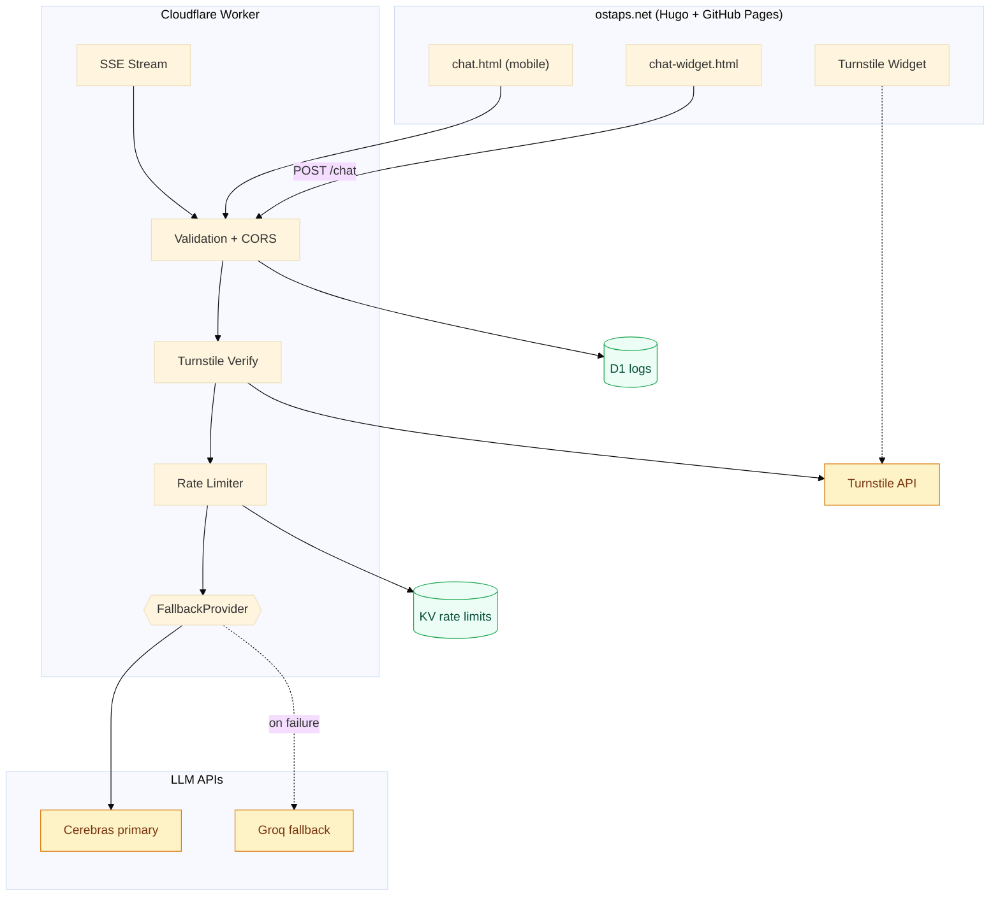

# ostaps.net

Personal site and portfolio. Hugo static site with a brutalist monospace aesthetic, hosted on GitHub Pages.

Includes an AI chat widget that lets visitors ask questions about my background - powered by a Cloudflare Worker backend with LLM completions.

## Architecture



## Stack

- **Site**: Hugo 0.134.2 (extended), custom layouts, plain CSS with custom properties
- **Hosting**: GitHub Pages, deployed via GitHub Actions on push to main
- **Chat backend**: Cloudflare Worker + D1 (SQLite) + KV (rate limiting) + Turnstile (bot protection)
- **LLM**: Cerebras (primary) + Groq (fallback), both free tier, swappable via LLMProvider interface
- **Analytics**: Simple Analytics
- **Fonts**: IBM Plex Mono (homepage), Verdana (content pages)

## Development

```bash
hugo server -D       # local dev with drafts
hugo --gc --minify   # production build
```

## Chat widget

On desktop, the chat opens as a floating panel. On mobile, it navigates to a dedicated `/chat/` page to avoid iOS Safari keyboard issues.

The backend lives in a separate repo (ostap-chat Cloudflare Worker).
